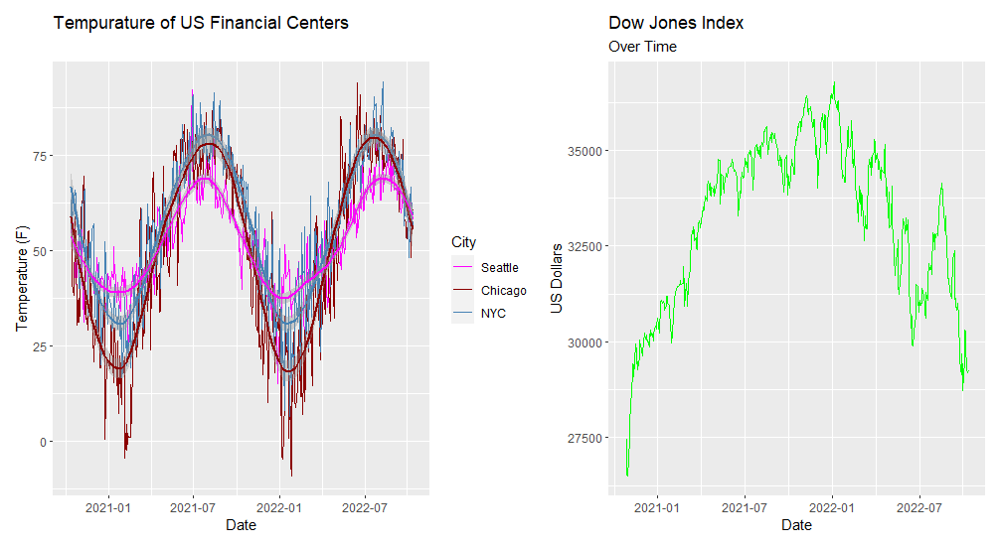
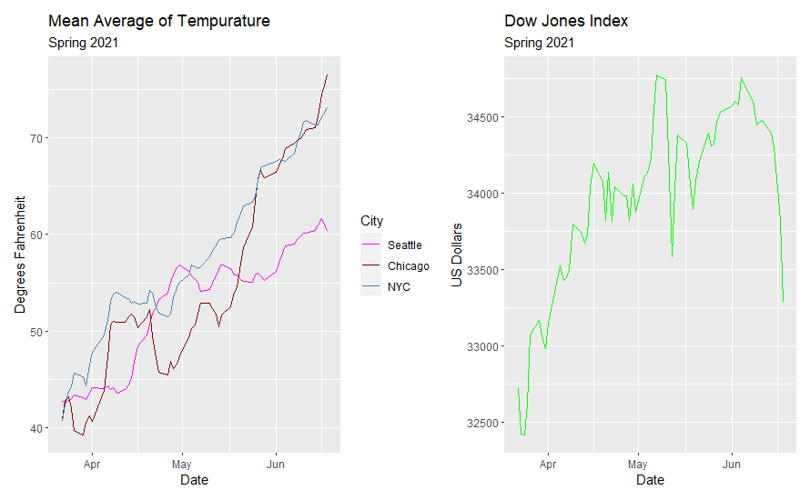
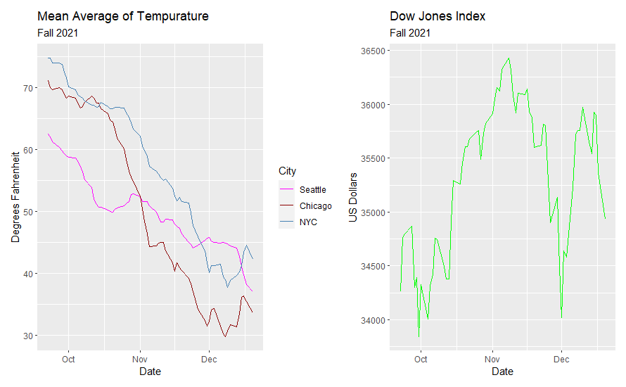
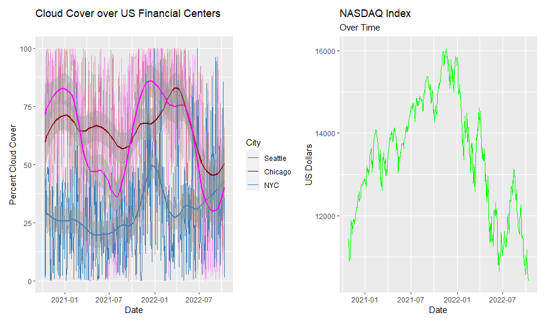
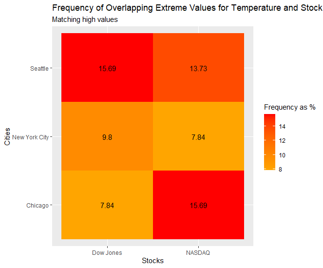
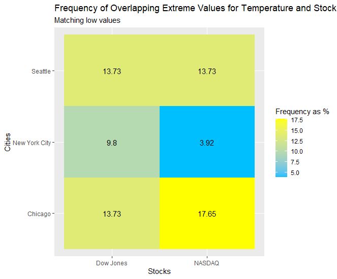
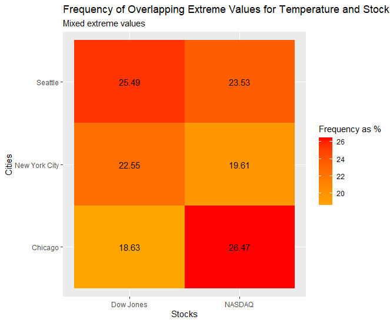

**Introduction**

An endless number of variables effect the condition of the stock market. We set out to determine a relationship between the stock market and just one of those variables. If the day-to-day emotions of traders, analysts, portfolio managers and otherwise in major financial centers are affected by the weather, that effect might be noticeable with the right visualizations. To do this, we used two years worth of historical data detailing weather in New York City, Chicago, and Seattle. The variables measured were mean temperature, precipitation, precipitation cover, and cloud cover. We paired this with data on the Dow Jones and NASDAQ from the same period. 

**Data Processing**

The closing price of the Dow Jones and NASDAQ were selected in order to get a consistent measure of the two. They were then bound together to get a data frame of the two financial indicators along with the associated dates. After this, a unique weather data frame was created for each city and only took measurements from 10/12/2020 to 10/12/2022. Similarly to the financial data frame, these three were bound together into one data frame. Each measurement of the weather was split into three different columns, one for each city. This was so that they didn't have repeating dates and could be graphed as time series data. The final step of processing the data was to combine the financial and weather data frames into one final data frame. This was performed thanks to a left join of the financial data frame to the weather data frame. This cut out the observations of weather variables that did not fall on a trading day but made it so there weren't any NA observations for either the Dow Jones or the NASDAQ. 

**Beginnings of Exploratory Analysis**

After processing the data, a look was taken into the variables and the relation they had to each other. Initially, general information was found that could be useful. An example was the percentage of rain a city got over the time period. A graph was constructed to show precipitation coverage, cloud cover, and temperature for all three cities. This helped show that these needed to be graphed more clearly, specifically the variables rain cover and cloud cover. In order to show these variables a 10-day moving average of them and temperature was taken. With this moving average cloud cover graph, we can see a trend of less clouds in the summer in Seattle and more in the winter while New York City and Chicago don't seem to follow the same patter. When doing this same process for temperature we could better relate the weather between each city. We found that Chicago had the largest range of temps followed by New York City and then Seattle. This makes sense since Seattle and New York City are closer to the water which helps them have smaller temperature spikes and dips. Finally we took a look at the NASDAQ and Dow Jones indexes to check if they behaved similarly despite differing in which stocks they include and their overall price. We did this by graphing each of them separately and together to see if the trends and general up and down movements were similar. They ended up being very similar which help confirm for us that the indexes are good measures for the overall economy.

An initial look was taken in comparing our weather variables with the indexes. We did this by first comparing the graphs we have for temperature and index. This yielded that there doesn't appear to be an overarching relation to seasonality between temperature and the index. We can then assume the same is true for the cloud cover in Seattle since that graph also follows the seasonality for temperature. With our temperature and index comparison, we did see some large downward slopes in the index when there was a large temperature dip mainly in Chicago as that was the location with the largest drops even after adjusting with the moving average. This shows that there may be some sway in the market based on the temperature in major financial cities. That being said, it appears the effect is mainly when there is abnormal changes in the temperature and not the normal ups and downs that we experience with the changing of seasons. The cloud cover data was much harder to do a visual comparison as the variance was still very high even after the moving average was applied. That being said, we did see that there is a rise in cloud cover that is very similar to the rise in the indexes in the start of 2022. This is an important note for our study because it could mean that the cloud cover could have the opposite effect on the market from what we thought it would de. We hypothesized that more clouds would lead to a drop in the stocks because of the perceived bad weather that large amounts of cloud cover bring. Based on this comparison of the graphs, it could instead be the case that the increased cloud cover leads to people being inside and spend more time working with the markets or investing more into the market. 

**Findings**

Below is the plot of temperature in US Financial Centers alongside the plot of the Dow Jones Index from October 12th, 2020 to October 11th, 2022. The temperature plot shows both the daily average temperature observations for each city as well as the smoothed line of those observations for each city while plot of the Dow Jones Index is that of the raw, observed daily close observations.

```{r echo = FALSE, fig.align='center', out.width = '100%'}

```

Comparing these graphs side by side eliminated the idea that their was an obvious correlation between the two. Overall, the temperature plot fluxuates predictably through the seasons with no clear trend. The Dow Jones plot did not follow this yearly trajectory and instead, trended upwards for the first year and downwards for the second. It was likely that this movement could be explained by the nature of the Covid-19 and post Covid-19 economies. Regardless, there was no visual relationships between year-round temperature in US Financial Centers and the Dow Jones Index.

This opened up the door for exploring how the temperature changes in the different seasons could lead to changes in the Dow Jones Index. As temperatures rose in the spring, it was possible that this had some effect on the mood of people working in large financial centers and thus changed the trajectory of the stocks within the Dow Jones Index. 

```{r echo = FALSE, fig.align='center', out.width = '100%'}

```

The 10-day mean average of temperatures in the three financial centers rose steadily for the entirety of the Spring of 2021. The Dow Jones Index also rose but only until June when it suddenly plummeted. The graphs seemed to lineup well in terms of trend but with how many unaccounted for factors were surely present, it was impossible to make a causal inference one way or the other. 

The same process was implemented for data spanning the Fall of 2021.

```{r echo = FALSE, fig.align='center', out.width = '100%'}

```

The 10-day mean average of temperatures in the three financial centers fell steadily as time went on with little in the way of volatility. This was counter to the behavior of the Dow Jones Index over that same period of time. There was no clear overall trend in its movements but it saw a lot of movement that went unexplained when comparing it to the graph of temperature. For this reason, there was no causal effect inferred between temperature in the Fall and the Dow Jones Index. 

Another weather variable that could effect the peoples' emotions was cloud cover. The 10-day mean average daily cloud cover in each of the three financial centers in the US was charted from October 2020 to October 2022 alongside the daily close of the NASDAQ index over the same period of time. The cloud cover for each city was plotted as the actual daily % cloud cover as well as the smoothed % cloud cover whereas only the daily closing values of the NASDAQ were plotted. 

```{r echo = FALSE, fig.align='center', out.width = '100%'}

```

The smoothed lines of percent cloud cover don't seem to show a distinguishable trend. This is certainly the case when comparing them to the plot of NASDAQ closing values. Because of this, no causal effect between cloud cover in US financial centers and the NASDAQ could be determined. 

An unexplored aspect of the analysis was how extreme weather events related to extreme fluctuations in stock price. Three heat maps were made to investigate possible relationships. 

The first heat map looked at the 90th percentile and above in terms of temperature in each of the three financial centers and the 90th percentile and above in terms index closing values. In other words, what percent of days that had extremely high temperatures compared to the average, also saw extremely high stock movements. 

```{r echo = FALSE, fig.align='center', out.width = '100%'}

```

The highest frequencies came from Seattle and the Dow Jones and Chicago and the NASDAQ with 15.69%. The lowest came from Chicago and the Dow Jones and New York City and the NASDAQ with 7.84%. Neither of these seemed far from what could be expected especially with the fact that only two years of data were taken into account. 

The second heat map was in the same spirit as the first but instead looked at overlapping frequency of extremely cold days and extreme downwards stock movements. Extreme weather days were days in the bottom 10% of temperature and extreme stock days were in the bottom 10% of Index closing value. 

```{r echo = FALSE, fig.align='center', out.width = '100%'}

```

The highest and lowest frequencies had a slightly larger span compared to the previous heat map. The lowest frequency was between New York City and the NASDAQ with 3.92%. The highest frequency was between Chicago and the NASDAQ with 17.65%. This means that the NASDAQ didn't drop frequently on the coldest days in New York City and dropped more often than normal on the coldest days in Chicago. 

The final heat map constructed looked extreme movements of both stocks and temperature (ie bottom 10th and upper 90th percentile for both). 

```{r echo = FALSE, fig.align='center', out.width = '100%'}

```

The frequency of extreme stock movements on days with extreme temperatures seemed to be about double that of what we saw in the previous two graphs. They were also fairly similar across city and index. For this reason, no relationship between extreme temperature and extreme stock market movements could be inferred.

**Conclusion**

After visual inspection, no relationships between the Dow Jones Industrial Average or the NASDAQ indices and the weather in New York City, Chicago, and Seattle could be determined. A likely reason behind that is that the stock market is influenced massively by factors outside of the weather. This does not mean that the weather in major financial centers in the United States has no effect on the stock market but to isolate that effect would require controlling for a potentially infinite number of factors. 